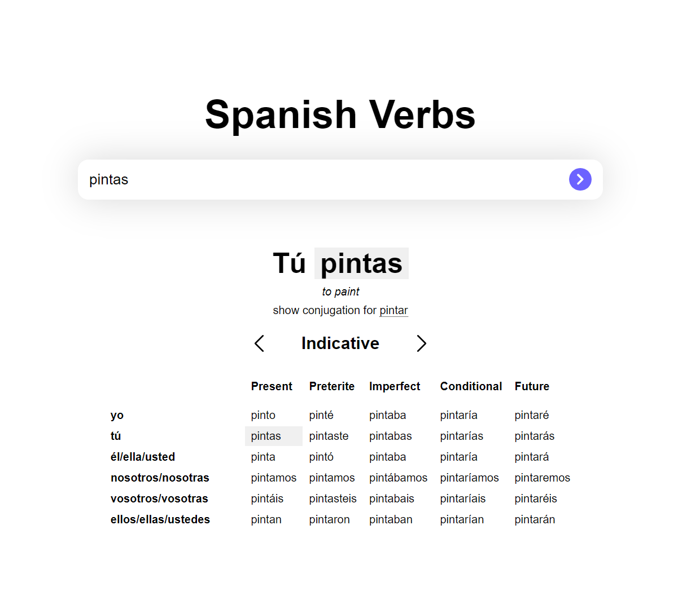

### Search, translate and conjugate spanish verbs + API

API repo can be found [here](https://github.com/Abrosss/es_conjunction_API)

- Live Site URL: [LIVE](https://spanish-verbs.netlify.app/)

### To do
  - [ ] make it possible to search and conjugate by typing in english words
  - [ ] typeahead search
  - [ ] add imperative mood in the table
  
### Built with

- SCSS 
- REACT
- NODE JS for API

